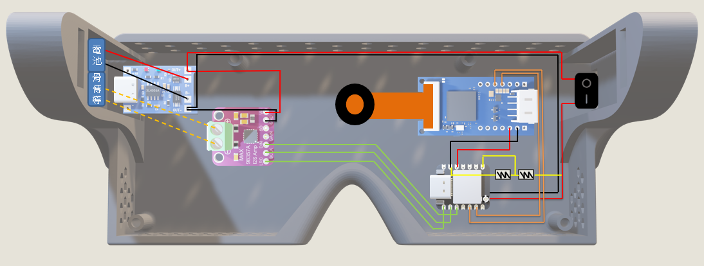
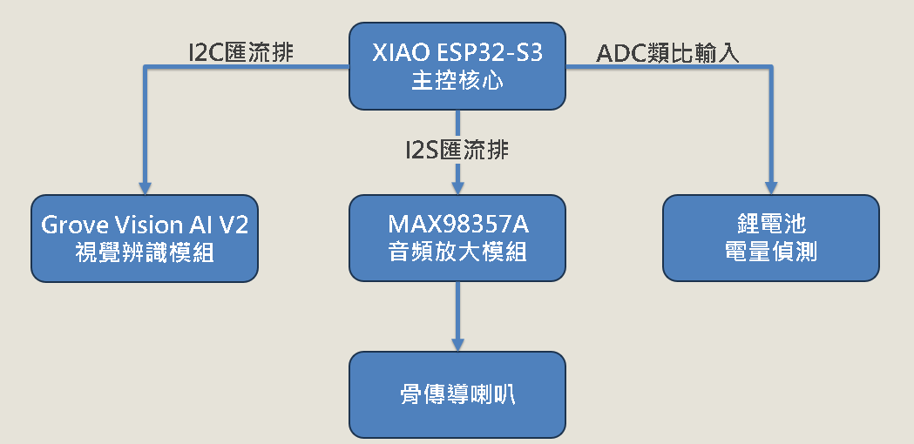
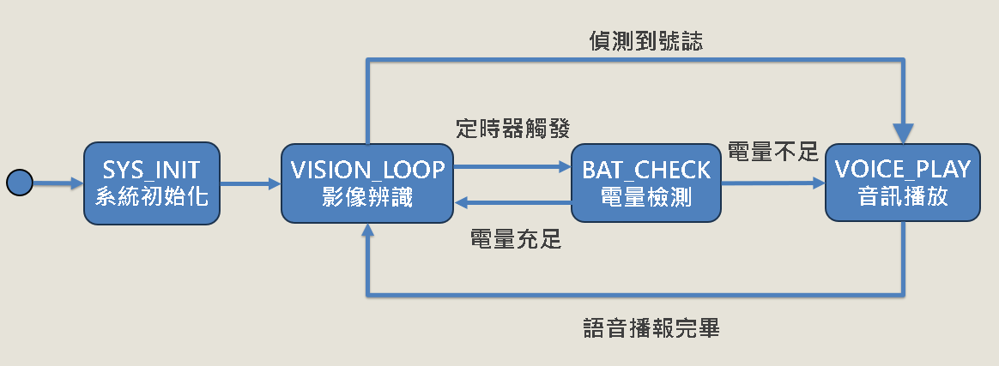

# Smart Guide Glasses (智慧視障導盲輔助眼鏡)

## 專案簡介
這是一個專為視障人士設計的輕量化穿戴式 AI 系統。本專案透過邊緣運算技術，在無網路的純離線狀態下進行影像辨識，並利用骨傳導技術將辨識結果與系統狀態（如電量警示）以語音播報給使用者，提供安全、即時且不干擾外界聽覺的環境感知輔助。

## 動機與背景
為了提供視障者更可靠的導引輔助，傳統依賴雲端運算的設備容易受網路延遲與無訊號死角的影響。因此，本專案致力於開發一款「純離線運作、硬體省電、且具備系統防錯機制」的邊緣運算裝置。同時，考量到聽覺對於視障者感知周遭環境的不可取代性，我們特別選用不遮蔽耳道的骨傳導發聲模塊，確保在傳遞系統語音提示的同時，使用者仍能清晰聽見外界的環境音。

## 功能特色
* **純離線 AI 影像辨識**：透過輕量化相機捕捉畫面，系統能在本地端進行高效率推論，辨識交通號誌（Traffic Label）等目標物，並即時回傳辨識分數與標籤。
* **骨傳導語音播報**：捨棄傳統喇叭，採用骨傳導模塊搭配高效率音訊放大晶片，播報預存於 Flash 中的輕量化語音（16kHz / 16-bit / Mono WAV 格式）。
* **多任務狀態機 (FSM) 架構**：系統內建穩定的狀態機設計，涵蓋「影像辨識」、「電壓檢測」與「聲音播放」三大核心狀態，能妥善處理定時電量檢查與高負載 AI 運算之間的排程衝突，防止系統阻塞卡死。
* **智慧電源管理與防錯**：開機即執行首檢與電壓檢測，並具備即時語音播報提醒；整體硬體與韌體經過省電優化，滿電狀態下續航力可達約 11 小時。
* **I2C 數據減量傳輸**：針對 AI 辨識結果，刻意捨棄繁重的座標資料 (x, y)，僅回傳輕量化的 JSON 格式標籤與信心度，大幅降低 I2C 通訊與主控板的資料處理負擔。

## 技術棧
* **主控與邊緣運算**：XIAO ESP32-S3
* **AI 推論與 NPU 部署框架**：SSCMA (Seeed Studio SenseCraft Master AI)
  > **技術亮點**：在此專案中，SSCMA 作為模型部署與神經網路處理（NPU 加速）的核心橋樑，負責將訓練好的 AI 模型最佳化並導入硬體中。它讓微型微控制器（MCU）也能具備足以應付視覺感知的邊緣運算能力，並透過 API (`AI.invoke()`, `AI.boxes()`) 輕鬆提取辨識結果。
* **相機模組**：OV5647
* **音訊放大晶片**：MAX98357A（採用 Class-D 高效率放大架構，轉換效率高達 92%）
* **通訊協定**：
  * **I2C**：用於鏡頭與主控板之間的 AI 辨識 JSON 數據通訊。
  * **I2S**：負責將 Flash 中的音訊檔案傳遞給放大晶片，並透過 LRC（左右聲道選擇）與 BCLK（位元時脈）確保時脈嚴格同步。
* **開發環境與語言**：C/C++, Arduino IDE (搭配 `<Seeed_Arduino_SSCMA.h>` 函式庫)

## 架構
**硬體佈線圖**

**硬體架構圖**

**系統狀態圖**

## 專案結構
本系統核心以 **狀態機 (Finite State Machine)** 為基礎，確保資料流與控制流的穩定：
* `VISION_LOOP (視覺感知)`：負責驅動 OV5647 鏡頭捕捉畫面，觸發 SSCMA 進行 AI 推論，並透過 I2C 解析回傳的 JSON 辨識數據。
* `電壓檢測`：利用 ADC 採樣公式，定期換算並監控當前電池電量。
* `聲音播放`：透過 I2S 協定，從主機板 Flash 提取特定情境的 WAV 音檔，推播至 MAX98357A 進行放大與骨傳導發聲。

## 未來展望
* **擴充空間座標解析**：目前為了通訊數據減量，暫時捨棄了目標物在畫面中的 (x, y) 座標。未來若硬體效能允許，可評估將座標資訊加回，進階換算成實體空間方位，提供視障者更精確的「方向性」語音引導。
* **更細緻的排程與動態中斷**：針對更複雜的應用場景，可進一步優化 FSM 架構，引入多執行緒的動態中斷機制，讓危急警告（如極端低電量或突發危險障礙物）能更快速地插隊中斷當前的運作任務。

